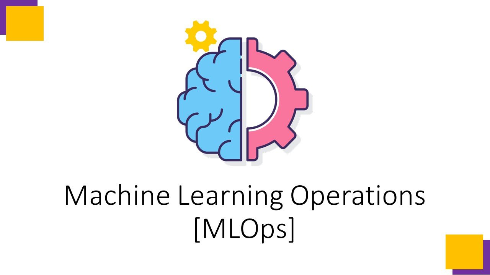

## 👋 Hi, I’m @pravin-nawghare
- I'm a self-taught **Data Scientist** passionate about turning raw data into insights and visual stories. I also like to create Machine Learning solutions for real-world problems.
- I started my data journey learning from **YouTube tutorials**, and later deepened my skills through a structured **online data analytics course**.
- Though I come from a non-traditional background, I'm confident in my ability to clean, analyze, and visualize data effectively using real-world tools.
- I am a huge fan of Cricket. I love to play cricket, watch cricket matches and read blogs related to it. I also like to cook in my free time.

## 🔭 I am currently working on 
- Creating an ai agent which can teach me new things. It is fully offline with a web ui to chat with it.
- Working on customer segmentation project on telecom company's customer to decrease customer churn.

## 👀 I’m interested in 
<!--
- Creating dashboards and solutions for real-world problems either using Machine Learning/Deep Learning or simply with Data Analysis.
-->
- Creating dashboards to provide information from raw data to make strategic decisions.
- Providing solutions for real-world problems either using Machine Learning/Deep Learning or simply with Data Analysis.
- Quering databases to extract meaningful data to provide insights for taking informed decisions.
  
## 📊 Featured Projects
### [Australian Road Accident Analysis - Power BI](https://github.com/pravin-nawghare/australia-accident-analysis)
Analyzed and visualized real-world road accident data from across Australia in Power BI. Created interactive dashboard to highlights key trends by location, vehicle type, and over speeding, etc. 
### [Customer Churn Prediction End-to-End ML Pipeline – Machine Learning](https://github.com/pravin-nawghare/Customer-Churn-Prediction)
Built a classification model to predict which customers are likely to churn. Worked on feature engineering, imbalanced data, and model tuning to improve performance. It automates the entire workflow from data ingestion to model deployment, with an api for real time inference.
### [Automotive Fuel Economy Prediction - Python](https://github.com/pravin-nawghare/Automotive-Fuel-Economy-Predictior)
Performed EDA on a vehicle dataset using Python. Identified key factors affecting car's fuel efficiency and presented insights through charts in a streamlit web app. Also created a machine learning model to predict fuel efficiency of the car.
 
## 🌱 I’m currently learning 
<!--

-->
- Machine Learning System Design
- Creating more advanced Power BI dashboards with DAX
- Integrating MLOps principles for seamless automation and collaboration

<h2 align="left">Tech stack I use</h2>

###

  
  
  
  
  
  
  
  
  
  
  
  
  
  
  
  
  
  
  
  
  
  
  
  
  
  
  
            
  
  
  
  
  
  

## 📫 How to reach me 

**Thanks for visiting my profile! If you're looking for a motivated, analytical thinker who loves to dig into data and bring value through insights—let’s talk.**

<!---
pravin-nawghare/pravin-nawghare is a ✨ special ✨ repository because its `README.md` (this file) appears on your GitHub profile.
You can click the Preview link to take a look at your changes.
--->
